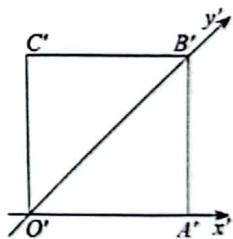
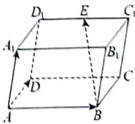
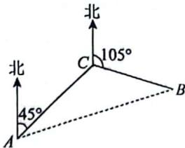
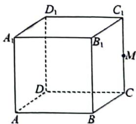
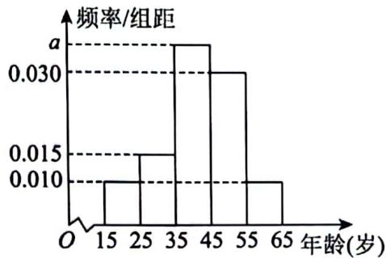
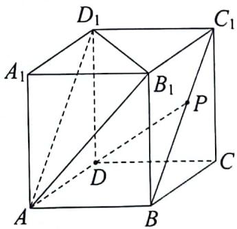
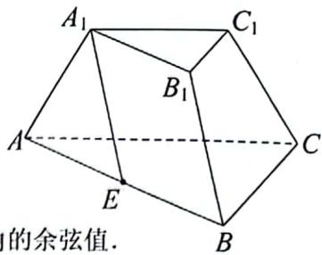
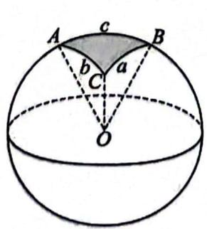
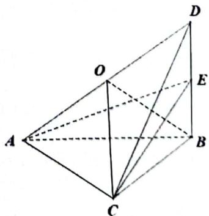

# 高2026届高一（下）期末考试

# 数学试卷

注意事项：

1. 答题前，考生务必将自己的姓名、准考证号、班级、学校在答题卡上填写清楚。  
2. 每小题选出答案后,用2B铅笔把答题卡上对应题目的答案标号涂黑,如需改动,用橡皮擦干净后,再选涂其他答案标号。在试卷上作答无效。  
3.考试结束后，请将答题卡交回，试卷自行保存。满分150分，考试用时120分钟。

# 一、单项选择题：本题共8小题，每小题5分，共40分。在每小题给出的四个选项中，只有一项是符合题目要求的。

1. 设 $\triangle ABC$ 的内角 $A, B, C$ 所对的边分别为 $a, b, c$ ，若 $a = \sqrt{3}$ ， $b = 1$ ， $A = \frac{\pi}{3}$ ，则 $B = (\quad)$

A. $\frac{\pi}{3}$

B. $\frac{\pi}{2}$

C. $\frac{\pi}{6}$

D. $\frac{\pi}{4}$

2. 某校高一年级有四个班共有学生 200 人, 其中 1 班 60 人, 2 班 50 人, 3 班 50 人, 4 班 40 人. 该校要了解高一学生对食堂菜品的看法, 准备从高一年级学生中随机抽取 40 人进行访谈, 若采取按比例分配的分层抽样, 且按班级来分层, 则高一 2 班应抽取的人数是 ( )

A. 12

B. 10

C. 8

D. 20

3. 已知平面四边形OABC用斜二测画法画出的直观图是边长为1的正方形 $O^{\prime}A^{\prime}B^{\prime}C^{\prime}$ 则原图形OABC中的 $\mathrm{AB} =$ （）

A. $\sqrt{2}$

B. $2 \sqrt{2}$

C. 3

D. 2

4. 已知 $m$ ， $n$ 是两条不重合的直线， $\alpha$ ， $\beta$ 是两个不重合的平面，则下列结论正确的是（）

A. 若 $\alpha / / \beta , m / / \beta$ ，则 $m / / \alpha$

B. 若 $m \perp \alpha, n \perp \alpha$ , 则 $m // n$

C. 若 $m // \alpha, m // \beta$ , 则 $\alpha // \beta$

D. 若 $m \perp n, m \subset \alpha$ , 则 $n \perp \alpha$

5. 甲、乙、丙3人独立参加一项挑战，已知甲、乙、丙能完成挑战的概率分别为 $\frac{1}{3}$ 、 $\frac{1}{3}$ 、 $\frac{1}{4}$ 则甲、乙、丙中有人完成挑战的概率为（）

A. $\frac{1}{5}$

B. $\frac{1}{3}$

C. $\frac{2}{5}$

D. $\frac{2}{3}$

6. 平行六面体 $ABCD - A_1B_1C_1D_1$ 中，底面ABCD为正方形， $\angle A_{1}AD = \angle A_{1}AB = \frac{\pi}{3}$ $AA_{1} = AB = 1$ ， $E$ 为 $C_1D_1$ 的中点，则异面直线 $BE$ 和 $DC$ 所成角的余弦值为（）

A. 0

B. $\frac{\sqrt{3}}{2}$

C. $\frac{1}{2}$

D. $\frac{\sqrt{3}}{4}$

7. 甲在 $A$ 处收到乙在航行中发出的求救信号后，立即测出乙在方位角（是从某点的正北方向线起，

依顺时针方向到目标方向线之间的水平夹角）为 $45^{\circ}$ 、距离 $A$ 处为 $10\mathrm{~nm}$ 距离的 $C$ 处，并测得乙正沿方位角为 $105^{\circ}$ 的方向，以 $6\mathrm{~nm}$ 距离/h的速度航行，甲立即以 $14\mathrm{~nm}$ 距离/h的速度前去营救，甲最少需要（）小时才能靠近乙.

A. 1

B. 2

C. 1.5

D. 1.2

8. 已知向量 $\overrightarrow{OA}, \overrightarrow{OB}$ 满足 $\left|\overrightarrow{OA}\right| = 1$ ， $\left|\overrightarrow{OB}\right| = 2$ ，且向量 $\overrightarrow{OB}$ 在 $\overrightarrow{OA}$ 方向上的投影向量为 $\overrightarrow{OA}$ 。若动点 C 满足 $\left|\overrightarrow{OC}\right| = \frac{1}{2}$ ，则 $\overrightarrow{CA} \cdot \overrightarrow{CB}$ 的最小值为（）

A. $-\frac{1}{2}$

B. $\frac{4 - 2\sqrt{6}}{3}$

C. $\frac{1 - \sqrt{7}}{2}$

D. $\frac{5 - 2\sqrt{7}}{4}$

# 二、多项选择题：本题共3小题，每小题6分，共18分.在每小题给出的选项中，有多项符合题目要求.全部选对的得6分，部分选对的得部分分，有选错的得0分.

9. 设复数 $z$ 的共轭复数为 $\overline{z}$ , $i$ 为虚数单位, 若 $(z + 2)i = 1 + i$ , 则 ( )

A. 复数 $z$ 的虚部为-1

B. $|z| = 2$

C. $\bar{z}$ 在复平面内对应的点在第一象限

D. $z^{8} = 16$

10. 一个袋子中有大小相同，标号分别为1，2，3，4的4个小球。采用不放回方式从中任意摸球两次，一次摸一个小球。设事件A=“第一次摸出球的标号小于3”，事件B=“第二次摸出球的标号小于3”，事件C=“两次摸出球的标号都是偶数”，则（）

A. $P(A) = P(B)$

B. $P(AB) = \frac{1}{6}$

C. $P(A \cup B) = \frac{2}{3}$

D. $P(AC) = \frac{1}{12}$

11. 如图，在棱长为2的正方体 $ABCD - A_1B_1C_1D_1$ 中，点 $M$ 分别为 $CC_1$ 上的动点， $O$ 为正方体内一点，

则以下命题正确的是（）

A. $B_{1} M + D M$ 取得最小值 $2 \sqrt{5}$   
B. 当 $M$ 为中点时, 平面 $B M D_{1}$ 截正方体所得的截面为平行四边形  
C. 四面体 $ABMD$ 的外接球的表面积为 $5 \pi$ 时, $CM = 1$   
D. 若 $AO = CO$ , $A_{1}O = 2$ , 则点 $O$ 的轨迹长为 $\sqrt{2}\pi$

# 三、填空题：本题共3小题，每小题5分，共15分.

12. 已知向量 $\vec{a} = (1,1)$ ， $\vec{b} = (m, -2)$ ，若 $\vec{a} / / (\vec{a} + \vec{b})$ ，则 $m =$   
13. 若圆锥的轴截面是边长为 2 的等边三角形, 则圆锥的侧面积为  
14. 记 $\triangle ABC$ 的内角 $A, B, C$ 所对的边分别为 $a, b, c$ ，已知 $a \sin A + c \sin C = a \cos C + c \cos A$ ，若 $\triangle ABC$ 的面积 $S = t b^{2} (t > 0)$ ，则 $t$ 的最大值为 ______.

# 四、解答题: 本题共 5 小题, 共 77 分. 解答应写出文字说明, 证明过程或演算步骤.

15.（本小题满分13分）为调查外地游客对洪崖洞景区的满意程度，某调查部门随机抽取了100位游客，现统计参与调查的游客年龄层次，将这100人按年龄（岁）（年龄最大不超过65岁，最小不低于15岁的整数）分为5组，依次为[15,25),[25,35),[35,45),[45,55),[55,65]，并得到频率分布直方图如下：

（1）求实数 $a$ 的值；  
（2）估计这100人年龄的样本平均数（同一组数据用该区间的中点值作代表）；  
（3）估计这100人年龄的第80百分位数。（结果保留一位有效数字，四舍五入）

16.（本小题满分15分）如图，在直四棱柱 $ABCD - A_1B_1C_1D_1$ 中，四边形 $ABCD$ 是一个菱形， $\angle DAB = 60^\circ$

点 $P$ 为 $BC_{1}$ 上的动点.

（1）证明： $DP / /$ 平面 $AB_{1}D_{1}$   
（2）试确定点 $P$ 的位置，使得 $BC \perp DP$

17.（本小题满分15分）在 $\triangle ABC$ 中，角A， $B$ ， $C$ 所对的边分别为 $a$ ， $b$ ， $c$ ， $a = 2$ ， $\sqrt{3}\left(\frac{\cos A}{\sin A} +\frac{\cos B}{\sin B}\right) = \frac{2c}{b}$

（1）求A的大小；  
（2）已知 $\overrightarrow{AD} = \frac{\overrightarrow{AB}}{3} + \frac{2\overrightarrow{AC}}{3}$ ，若 $\mathbf{A}$ 为钝角，求 $\triangle ABD$ 面积的取值范围.

18.（本小题满分17分）已知三棱台 $ABC - A_{1}B_{1}C_{1}$ 中， $\Delta ABC$ 为正三角形， $A_{1}B_{1} = AA_{1} = BB_{1} = \frac{1}{2} AB = 1$ 点 $E$ 为线段 $AB$ 的中点.

（1）证明： $A_{1}E / / \text{平面} B_{1}BCC_{1}$   
（2）延长 $AA_{1},BB_{1},CC_{1}$ 交于点 $P$ ，求三棱锥 $P - ABC$ 的体积最大值；  
（3）若二面角 $A - CC_{1} - B$ 的余弦值为 $\frac{1}{3}$ ，求直线 $BB_{1}$ 与平面 $A C C_{1}A_{1}$ 所成线面角的余弦值.

19.（本小题满分17分）球面三角学是研究球面三角形的边、角关系的一门学科．如图，球O的半径为R．A、B、C为球面上三点，劣弧BC的弧长记为a，设 $O_{a}$ 表示以O为圆心，且过B、C的圆，同理，圆 $O_{b},O_{c}$ 的劣弧AC、AB的弧长分别记为 $b$ ， $c$ ，曲面ABC（阴影部分）叫做球面三角形.

若设二面角 $C - OA - B, A - OB - C, B - OC - A$ 分别为 $\alpha, \beta, \gamma$ ，则球面三角形的面积为

$$
S _ {\text {球 面} \Delta A B C} = (\alpha + \beta + \gamma - \pi) R ^ {2}.
$$

（1）若平面OAB、平面OAC、平面OBC两两垂直，求球面三角形ABC的面积；  
（2）若平面三角形ABC为直角三角形， $AC\bot BC$ ，设 $\angle AOC = \theta_{1},\angle BOC = \theta_{2},\angle AOB = \theta_{3}.$

则：①求证： $\cos \theta_{1} + \cos \theta_{2} - \cos \theta_{3} = 1$

② 延长 AO 与球 O 交于点 D，若直线 DA，DC 与平面 ABC 所成的角分别为 $\frac{\pi}{4}, \frac{\pi}{3}$ ， $\overrightarrow{BE} = \lambda \overrightarrow{BD}, \lambda \in (0,1]$ ，S 为 AC 中点，T 为 BC 中点，设平面 OBC 与平面 EST 的夹角为 $\theta$ ，求 $\sin \theta$ 的最小值，及此时平面 AEC 截球 O 的面积.

